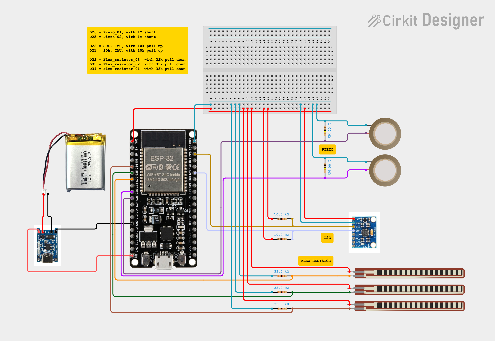
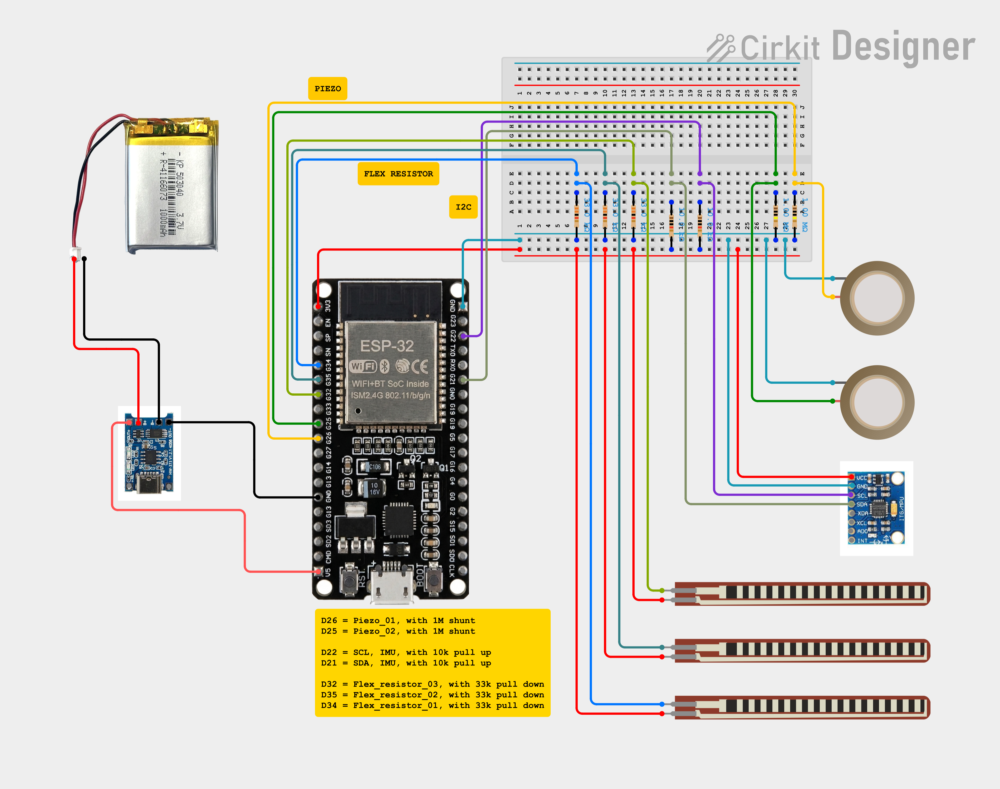

# FootSense — Wiring & Connections

FootSense Circuit, breadboard version

https://app.cirkitdesigner.com/project/b28bd193-1c41-4074-a6af-9dc82b0b8f14




FootSense Circuit, simplified version

https://app.cirkitdesigner.com/project/80fe3b59-e1d4-4a58-a3ab-f5aec5795ba8




Complete pin-by-pin connection guide for the FootSense smart insole.  
Board: **ESP32 DevKit V1 (38-pin, DOIT "WROOM-32")**

---

## Important: Pin Selection Notes

- **All analog sensors use ADC1 pins only** (GPIO25, 26, 32, 33, 34, 35). ADC2 pins (including GPIO4) conflict with Wi-Fi and will give unreliable readings when the dashboard is active. Do not swap these to ADC2 pins.
- **GPIO34 and GPIO35 are input-only** — no internal pull-up/down resistors. This is fine since flex sensors only ever need to be read, never driven.
- **GPIO6–11 are reserved** for the onboard SPI flash chip. Never use these.
- **GPIO0, 2, 12, 15** are boot-strapping pins. Avoid unless you know what you're doing.

---

## Step 1 — Power Bus (build this first)

Run two continuous bus strips across your perfboard before wiring anything else. Every component taps into these rather than running individual wires back to the ESP32.

| From | To |
|---|---|
| ESP32 `3V3` pin | 3V3 power bus rail |
| ESP32 `GND` pin | GND bus rail |

---

## Step 2 — MPU6050 (Gyroscope / Accelerometer)

Used for step counting and impact angle detection.

| MPU6050 Pin | ESP32 Pin | Notes |
|---|---|---|
| VCC | 3V3 bus | |
| GND | GND bus | |
| SDA | GPIO21 | |
| SCL | GPIO22 | |

**Pull-up resistors required** — most bare MPU6050 breakout boards do not include these onboard:

| Resistor | From | To |
|---|---|---|
| 10kΩ (resistor 1) | 3V3 bus | GPIO21 (SDA line) |
| 10kΩ (resistor 2) | 3V3 bus | GPIO22 (SCL line) |

Without these pull-ups the MPU6050 will NACK and fail to initialize, even if all other wiring is correct.

---

## Step 3 — Flex Sensors (Arch Bend Detection)

Each flex sensor is wired as a **voltage divider** with a 33kΩ reference resistor. No amplifier needed.

```
3V3 bus ── [Flex Sensor] ──┬── ESP32 analog pin
                             │
                         [33kΩ resistor]
                             │
                           GND bus
```

The junction between the flex sensor's second lead and the top of the resistor is the point that connects to the ESP32 analog pin. Make sure all three meet at one solder point, not two separate connections that happen to be close together.

| Sensor | Zone | Flex Lead 1 | Junction (Lead 2 + Resistor) | Resistor Other Leg |
|---|---|---|---|---|
| Flex 1 | Medial arch | 3V3 bus | GPIO34 | GND bus |
| Flex 2 | Rear arch | 3V3 bus | GPIO35 | GND bus |
| Flex 3 | Anterior arch | 3V3 bus | GPIO32 | GND bus |

**Tuning note:** The firmware auto-calibrates a resting baseline for each flex sensor at startup. Keep all three sensors flat and unbent during the first 2 seconds after power-on.

---

## Step 4 — Piezo Discs (Impact Detection)

Each piezo disc gets a **1MΩ damping resistor wired in parallel** across its two leads. This resistor is not a voltage divider — it sits directly across the piezo (not in series) to limit voltage spikes to a safe range for the ESP32's analog input. Do not omit it.

```
Piezo (+) ──┬── ESP32 analog pin
             │
         [1MΩ resistor]
             │
Piezo (−) ──┴── GND bus
```

| Sensor | Zone | Piezo (+) + Resistor Leg | Piezo (−) + Resistor Other Leg |
|---|---|---|---|
| Piezo 1 | Heel | GPIO25 | GND bus |
| Piezo 2 | Forefoot | GPIO26 | GND bus |

**Why GPIO25/26 and not GPIO4/33:** GPIO4 is an ADC2 pin and stops working when Wi-Fi is active. GPIO25 and GPIO26 are ADC1-adjacent DAC pins that work reliably as analog inputs alongside active Wi-Fi.

**Threshold tuning:** The firmware uses separate impact thresholds per piezo since the two discs can vary in sensitivity depending on mounting and gluing. See `PIEZO_IMPACT_THRESHOLD[2]` in `smart_insole_final.ino` and tune each index independently based on what you measure at rest vs. real foot-strike.

---

## Step 5 — Power (Battery → ESP32)

| From | To | Notes |
|---|---|---|
| Li-ion cell (+) | HW-373 `B+` | |
| Li-ion cell (−) | HW-373 `B−` | |
| HW-373 `OUT+` | Boost converter `IN+` | |
| HW-373 `OUT−` | Boost converter `IN−` | |
| Boost converter `OUT+` (5V) | ESP32 `VIN` pin | Must be a stable 5V |
| Boost converter `OUT−` | GND bus | |

**Why this chain:** The HW-373 module (TP4056-based) handles charging and protection for the Li-ion cell but outputs raw battery voltage (3.0–4.2V depending on charge state), not a regulated 5V. The ESP32's `VIN` pin expects a stable 5V input. A separate boost converter steps the battery voltage up to 5V and feeds it into `VIN`, where the board's onboard regulator then produces the 3.3V that all sensors run on.

Do not connect the battery or HW-373 output directly to the ESP32's `3V3` pin — this bypasses the onboard regulator and can damage the board.

---

## Complete Pin Summary

| Component | Signal | ESP32 Pin | GPIO |
|---|---|---|---|
| MPU6050 | VCC | 3V3 bus | — |
| MPU6050 | GND | GND bus | — |
| MPU6050 | SDA | GPIO21 | 21 |
| MPU6050 | SCL | GPIO22 | 22 |
| Pull-up resistor (SDA) | 3V3 → SDA | GPIO21 | 21 |
| Pull-up resistor (SCL) | 3V3 → SCL | GPIO22 | 22 |
| Flex 1 — Medial arch | Analog out | GPIO34 | 34 |
| Flex 2 — Rear arch | Analog out | GPIO35 | 35 |
| Flex 3 — Anterior arch | Analog out | GPIO32 | 32 |
| Piezo 1 — Heel | Analog out | GPIO25 | 25 |
| Piezo 2 — Forefoot | Analog out | GPIO26 | 26 |
| Boost converter 5V out | Power in | VIN | — |
| Boost converter GND | Ground | GND bus | — |

---

## Resistor Summary

| Resistor | Value | Qty | Location |
|---|---|---|---|
| MPU6050 SDA pull-up | 10kΩ | 1 | 3V3 bus → GPIO21 |
| MPU6050 SCL pull-up | 10kΩ | 1 | 3V3 bus → GPIO22 |
| Flex sensor voltage divider | 33kΩ | 3 | One per flex sensor, bottom of voltage divider |
| Piezo damping | 1MΩ | 2 | In parallel across each piezo's two leads |

---

## Perfboard Assembly Order

Build in this order to avoid running jumper wires over components you haven't placed yet:

1. Solder 3V3 and GND bus strips first — full length of the board
2. Place and solder the ESP32 DevKit
3. Place and solder the MPU6050 + both pull-up resistors
4. Wire each flex sensor's voltage divider (sensor + resistor + junction point), one at a time
5. Wire each piezo's damping resistor in parallel, one at a time
6. Wire the power chain last (HW-373 → boost converter → VIN)
7. Continuity-check every connection with a multimeter before first power-on

---

## Troubleshooting Quick Reference

| Symptom | Most likely cause | Fix |
|---|---|---|
| MPU6050 shows NACK / connection failed | Missing pull-up resistors | Add 10kΩ from 3V3 to both SDA and SCL |
| Flex sensor reads 0 and never changes | Open circuit at junction point | Check the three-way junction solder point (sensor lead 2 + resistor leg + signal wire) |
| Flex sensor jittery at rest, never reads 0 | ADC noise | Increase `FLEX_DEADZONE` in firmware (try 25–30) |
| Piezo never triggers | Threshold too high for this sensor | Run isolated piezo test, read peak deviation, set `PIEZO_IMPACT_THRESHOLD` to half that value |
| Dashboard shows connection error | ESP32 not on same WiFi as your device | Confirm SSID/password in firmware, check Serial Monitor for IP address |
| ADC readings erratic when WiFi active | ADC2 pin used for a sensor | Move sensor to an ADC1 pin (GPIO25, 26, 32, 33, 34, or 35) |
